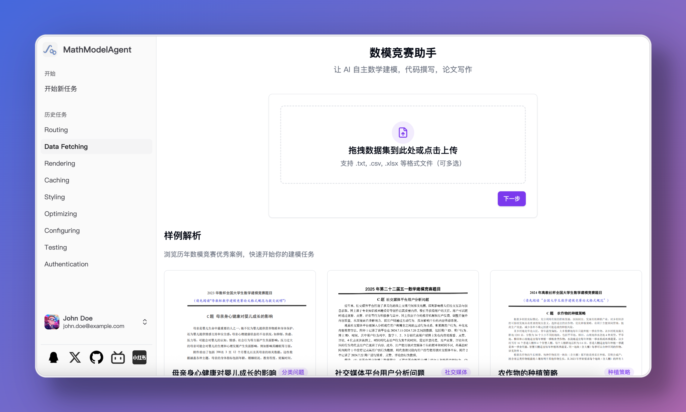
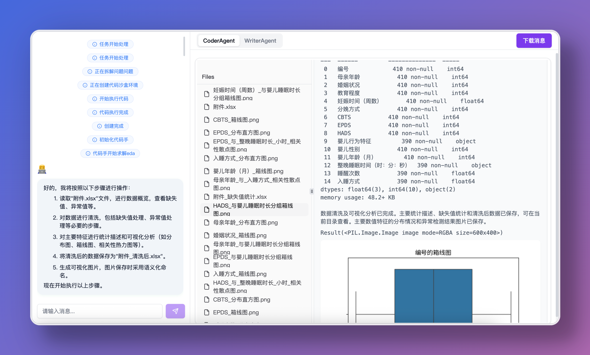
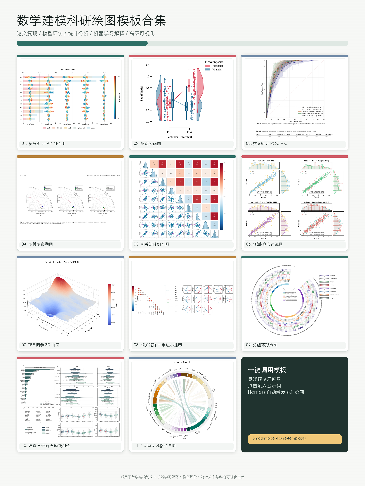

<h1 align="center">🤖 MathModelAgent 📐</h1>
<p align="center">
    
</p>
<h4 align="center">
    专为数学建模设计的 Agent<br>
    自动完成数学建模，生成一份完整的可以直接提交的论文。
</h4>

<h5 align="center">简体中文 | <a href="README_EN.md">English</a></h5>

<p align="center">
    <a href="https://github.com/jihe520/MathModelAgent/releases/latest"><b>⬇️ 下载最新桌面版（推荐）</b></a>
</p>

---

## 🧠 Codex 本地版（推荐给开发者和参赛队）

本仓库提供 Codex 原生的仓库级 skill 部署。源码、skill、竞赛工作区、Python 虚拟环境、前端依赖、Redis 和运行日志都可保存在仓库目录内。

```powershell
git clone https://github.com/jihe520/MathModelAgent.git MathModelAgent
cd MathModelAgent

# 只使用 Codex + SKILLS（无需 WebUI、Redis 或模型 API Key）
powershell -ExecutionPolicy Bypass -File scripts/setup-local.ps1 -CodexOnly

# 新建本届比赛工作区并启动 Codex
mkdir workspaces\cumcm
cd workspaces\cumcm
codex
# 在 Codex 中输入：$1start-mathmodel 完成这个数学建模任务
```

完整 WebUI 本地部署见[方案二](#-方案二-本地部署)。Codex CLI/IDE 会从仓库的 `.agents/skills` 自动发现技能；若技能列表没有立即刷新，重启一次 Codex。

从创建比赛工作区到最终验收的完整流程见：[Codex CUMCM 使用指南](docs/md/Codex-CUMCM使用指南.md)。

## 🖥️ 桌面版（推荐使用方式）

> **不想折腾环境？直接下载桌面版，开箱即用。**
>
> 👉 **[前往 Releases 下载最新版本](https://github.com/jihe520/MathModelAgent/releases/latest)**

桌面版已内置 Claude Code 与全套 MathModelAgent SKILLS，无需安装 Python / Node.js / Redis，也无需手动配置 SKILL，装好填一个模型 API Key 即可开始建模。

| 系统 | 下载文件 |
|------|----------|
| macOS（Apple 芯片 M 系列） | `mathmodel-<version>-arm64.dmg` |
| macOS（Intel 芯片） | `mathmodel-<version>-x64.dmg` |
| Windows 64 位 | `mathmodel-<version>-x64.exe` |

macOS 安装包已 Developer ID 签名并通过 Apple 公证。

> [!TIP]
> 不确定自己的 Mac 是哪种芯片？点击左上角  → 关于本机，看「芯片」一栏：显示 Apple M 系列选 arm64，显示 Intel 选 x64。

> [!WARNING]
> Windows 安装包当前未签名，首次安装或运行时可能出现 Microsoft Defender SmartScreen 提示，请选择「更多信息」→「仍要运行」，并务必从官方 [Releases 页面](https://github.com/jihe520/MathModelAgent/releases/latest) 下载。

安装后应用会自动检查更新（macOS 支持自动更新，Windows 待代码签名证书配置完成后启用）。

如果你是开发者，想自行部署或参与贡献，请继续阅读下方的 [SKILLS](#skills) 与 [使用教程](#-使用教程)。

---

## 🌟 愿景：

3 天的比赛时间变为 1 小时
自动完整一份可以获奖级别的建模论文

<p align="center">
    
    
</p>

## ✨ 功能特性

- 🔍 自动分析问题，数学建模，编写代码，纠正错误，撰写论文
- 💻 Code Interpreter
    - local Interpreter: 基于 jupyter , 代码保存为 notebook 方便再编辑
    - 云端 code interpreter: [E2B](https://e2b.dev/) 和 [daytona](https://app.daytona.io/)
- 🧮 Python + MATLAB：Codex 工作流可生成并执行 `.py` 或 `.m`；支持 MathWorks Agentic Toolkit（可选 MCP）并保留独立 `matlab -batch` 复现，兼容代码可回退到 GNU Octave
- 📄 Typst + LaTeX：17 套中英文比赛模板均提供双引擎版本
- 📝 生成一份编排好格式的论文
- 🤝 可审计 multi-agents：Codex 总控，使用哈希固定的上下文包和 Agent 结果隔离题意、建模、求解、写作与验证；AI 不得自批门禁
- 🔄 multi-llms：可选 OpenAI-compatible 异构审查接口（含 DeepSeek），默认最小数据披露并对 live competition fail-closed
- 🌐 空间建模工具链：检查二维/三维坐标、经纬度、距离矩阵、邻接、轨迹、覆盖与空间语义
- 🧪 算法实验室：按问题结构检索和筛选精确法、图/覆盖算法、确定性全局法、PSO、CMA-ES、NSGA-II 与代理优化，支持弱机/高性能长跑配置、多种子并行、全量失败记录和跨 seed 统计
- 🤖 支持所有模型: [litellm](https://docs.litellm.ai/docs/providers)
- 💰 成本低：workflow agentless，不依赖 agent 框架
- 🧩 自定义模板：prompt inject 为每个 subtask 单独设置需求
- 🌐 文献检索：以 OpenAlex 和可审计证据包为当前实现；Tavily 与完整 RAG 仍是 WebUI 路线图
- 🤝 人机门禁：Codex workflow 已有七个不可伪造的人工 checkpoint；WebUI 审批交互仍在完善
- 🛡️ 失败隔离：输入/合同/结果哈希、阶段 STALE 传播、Agent 分歧报告和确定性复现检查


---
---

我在平台中托管了一个在线版本，方便使用，欢迎体验：

https://mathmodel.top/home

## SKILLS

项目蒸馏成完全由 SKILLS 驱动
不再做 Harness 层

### Intro

MathModelAgent SKILL —— 直接在 Harness 中驱动的数学建模自动化方案.

**💰 开源免费，接入任意模型**
完全开源免费，可接入任何模型。

**🧠 端到端自动化**
从问题分析、建模、编码、绘图到论文排版和验收，一条 `$1start-mathmodel` 命令串联完成。

**📄 17 套 Typst + 17 套 LaTeX 论文模板**
内置中英文主流赛事模板（国赛、华数杯、华为杯、MCM/ICM 等），自动匹配赛事类型和排版引擎，生成可编译 PDF 论文。

**🧮 Python + MATLAB 双语言建模**
`3coding-visual` 可按 `plan.md` 生成 Python 或 MATLAB 项目；MATLAB 路径支持本机 `matlab -batch`、固定随机种子、CSV/MAT 结果、矢量 PDF 图和可复现日志，GNU Octave 仅作为兼容备用。

**🤝 多 Agent 与多模型复核**
`mathmodel-orchestrator` 让 Codex 作为总控，把独立建模、挑战、数值审计和论文双审查分派给隔离 Agent。各 Agent 只读取白名单上下文包并提交结构化结果；DeepSeek 等 OpenAI-compatible API 是可选 reviewer，不保存密钥，也不能替代程序验证或人工批准。

**🌐 空间建模与大规模算法实验**
`mathmodel-spatial` 固定坐标/单位/距离语义并审计距离、拓扑、轨迹和覆盖；`mathmodel-algorithm-lab` 根据变量、约束、凸性和评估成本筛选算法，提供 PSO 合成基线、计算能力探测以及可从弱机平滑迁移到 i9/RTX 4060 的预算化多种子运行计划。

**📐 内置建模知识库**
包含完整的建模规范、模型选择决策树（AHP、TOPSIS、ARIMA、GA 等）、常见易错模式和 MCM/ICM 评分标准，每个阶段自动参考，降低模型幻觉。

**✅ 9 步自动验收**
文本泄漏检测 → 数值一致性校验 → Typst 编译 → PDF 可视化检查，确保论文零低级错误。

**🔧 可组合、可扩展**
每个阶段是独立 Skill，可单独调用（如只跑分析、只写论文）；模板和知识库可自由扩展；支持 Typst 生态排版。

skills 中包含一个科研绘图模板skill,可以绘制一些炫酷的科研图表




### Install & Usage

Codex 仓库级安装（推荐，不写入用户目录）

```powershell
powershell -ExecutionPolicy Bypass -File scripts/setup-codex.ps1
```

也可安装到其他支持 Agent Skills 的工具：

```
npx skills add jihe520/MathModelAgent --all
```

运行
```
// claude
claude --dangerously-skip-permissions
claude: /1start-mathmodel 完成这个数学建模任务

// Codex（推荐）
codex
codex: $1start-mathmodel 完成这个数学建模任务
```

其他命令
```
$doctor 检查环境、LaTeX 和 MATLAB/Octave
$typst-author 查询 Typst 知识
```


### What Can You Contribute?

项目以后只会做 SKLLS 层的迭代和优化，不会再做其他部分。

如果你希望寻找 Agent 开发岗位，你可以研究该项目 Agent 设计并贡献，我会尽量合并.

你能做什么：

- 优化贡献比赛 typst Template , 你可以找一些 LaTeX 转成 typst
- 优化 SKILL Workflow
- 在不同的 Harness 上测试 不同的 LLM, 提供反馈和案例放在 example 仓库

Harness SKILL 的优化需要大量黑盒测试和调优.


### Thinking

- 两年前，我做了一个 Mulit-Agent 的数学建模项目并开源出来，收到了社区的欢迎和很多 star, 感谢大家支持。
- 感谢开源的 latex 模板，我在此基础上转化为 typst 模板
- 此 SKILL 是一个基础模板，你可以基于此构建更适合你自己的 MathModel SKILL
- For Agent DEVs : 两年前，我都是自己实现一套 Agent 框架，现在和以后更多的 Agent 产品直接基于 Harness 如 Codex / Claude Code / Pi  + SKILLS 来构建

---
---


## 🚀 后期计划

- [x] 添加并完成 webui、cli
- [x] 完善的教程、文档
- [ ] 提供 web 服务
- [ ] 英文支持（美赛）
- [x] 集成 LaTeX 模板（17 套，和 Typst 一一对应）
- [ ] 接入视觉模型
- [x] 添加正确文献引用
- [x] 更多测试案例
- [x] docker 部署
- [x] Codex workflow 人工门禁：七个不可由 Agent 自批的 checkpoint
- [ ] WebUI HIL：关键节点暂停等待用户审批，支持 6 种决策动作（confirm/edit/regenerate/ask/skip/abort）
  <!-- TODO: 数据模型已实现，WebUI 工作流集成不完整 -->
- [ ] feedback: 评估器评分 + 反馈注入重跑，先 Writer 后 Coder
  <!-- TODO: 核心逻辑未实现，仅有 Agent 基类中的 TODO 注释 -->
- [x] codeinterpreter 接入云端 如 e2b 等供应商..
- [x] MATLAB（Codex skills：生成、CLI 执行、官方 Agentic Toolkit 可选探测、结果/图表、论文附录、复现验收）
- [ ] R 语言
- [ ] 绘图 napki,draw.io,plantuml,svg, mermaid.js
- [x] 隔离 benchmark 封存/验封协议
- [ ] 完整 benchmark runner、评分器和模型排行榜
- [ ] web search tool: Tavily API 搜索互联网获取真实数据
  <!-- NOTE: 原计划 Tavily API 未实现，当前使用 OpenAlex 替代 -->
- [ ] RAG 知识库: ChromaDB + Rerank 检索建模方法、代码模板、论文写作参考
  <!-- TODO: 仅配置项存在，核心检索逻辑未实现 -->
- [ ] A2A hand off: Fallback 自动切换备用模型 + 有限重试 + Evaluator Shadow Mode
  <!-- TODO: 配置项和核心逻辑均未实现，仅有基础重试机制 -->
- [ ] chat / agent mode

## 视频demo

<video src="https://github.com/user-attachments/assets/954cb607-8e7e-45c6-8b15-f85e204a0c5d"></video>

> [!CAUTION]
> 项目处于实验探索迭代demo阶段，有许多需要改进优化改进地方，我(项目作者)很忙，有时间会优化更新
> 欢迎贡献


## 📖 使用教程


提供三种部署方式，请选择最适合你的方案：
1. [docker(最简单)](#-方案一docker-部署推荐最简单)
2. [本地部署](#-方案二-本地部署)
3. [脚本本地部署(社区)](#-方案三自动脚本部署来自社区)


下载项目

```bash
git clone https://github.com/jihe520/MathModelAgent.git # 克隆项目
```


> 如果你想运行 命令行版本 cli 切换到 [master](https://github.com/jihe520/MathModelAgent/tree/master) 分支,部署更简单，但未来不会更新


### 🐳 方案一：Docker 部署（推荐：安全简单）

> 确保电脑安装了 docker 环境

1. 启动服务

在项目文件夹下运行:

```bash
docker-compose up
```

2. 访问

现在你可以访问：
- 前端界面：http://localhost:5173
- 后端API：http://localhost:8000

3. 配置

侧边栏 -> 头像 -> API Key

### 💻 方案二: 本地部署（推荐项目开发者部署）

Windows 推荐使用仓库内的一键脚本。它把后端虚拟环境放到 `backend/.venv`，pnpm/Redis/日志放到 `.runtime`，不会要求全局安装 pnpm 或 Redis：

```powershell
# 安装当前目录内的 WebUI 依赖
powershell -ExecutionPolicy Bypass -File scripts/setup-local.ps1

# 后台启动 Redis、FastAPI 和 Vue
powershell -ExecutionPolicy Bypass -File scripts/start-local.ps1

# 查看状态 / 停止
powershell -ExecutionPolicy Bypass -File scripts/status-local.ps1
powershell -ExecutionPolicy Bypass -File scripts/stop-local.ps1
```

访问前端 <http://127.0.0.1:5173>，后端文档 <http://127.0.0.1:8000/docs>。首次运行后在侧边栏配置 WebUI 所需的模型 API Key；Codex SKILLS 路径不需要在本项目中保存 API Key。

以下是 macOS/Linux 或希望手动管理依赖时的步骤。

> 确保电脑中安装好 Python、Node.js、Redis 环境。


#### step1:安装依赖

1. 下载Redis(记得设置环境变量redis_path)

- windows 下载地址：<https://github.com/tporadowski/redis/releases>
- linux or mac 下载地址：<https://redis.io/docs/latest/operate/oss_and_stack/install/install-stack/>

2. 安装后端依赖

```bash
# ============ 安装依赖 ============
# 1. 切换到 backend 目录
cd backend
# 2. 安装 uv 包管理器（推荐）
pip install uv
# 3. 同步项目依赖
uv sync
```

```bash
# ============ MacOS / Linux 安装命令 ============
# 1. 设置环境变量
export ENV=DEV
export REDIS_URL=redis://localhost:6379/0
```

```powershell
# ============ Windows PowerShell 安装命令 ============
# 1. 设置环境变量
$env:ENV="DEV"
$env:REDIS_URL="redis://localhost:6379/0"
# 2. uv sync 会自动创建 backend/.venv，无需手工创建 venv
uv sync
```

3.安装前端依赖

```bash
cd frontend # 切换到 frontend 目录下
npm install -g pnpm
pnpm i
```

#### step2:启动项目

**Windows 用户完成 `scripts/setup-local.ps1` 后，可双击 `win_start.bat` 启动。**

1.启动 Redis

```bash
redis-server
```

2.启动后端

```bash
# ============ MacOS / Linux 安装命令 ============
# 1. 激活虚拟环境
source .venv/bin/activate
# 2. 启动后端服务（激活后可直接使用 uvicorn 命令）
uvicorn app.main:app --host 0.0.0.0 --port 8000 --ws-ping-interval 60 --ws-ping-timeout 120 --reload
```

```bash
# ============ Windows PowerShell 安装命令 ============
# 1. 切换到 backend 目录
cd .\backend\
# 2. 激活虚拟环境
.\.venv\Scripts\Activate.ps1
# 3. 启动后端服务
uvicorn app.main:app --host 0.0.0.0 --port 8000 --ws-ping-interval 60 --ws-ping-timeout 120 --reload
```


3.启动前端

```bash
cd .\frontend\
pnpm run dev
```

修改 backend/.env.dev 的环境变量 **REDIS_URL**

配置API Key

1. 使用 WebUI
    侧边栏 -> 头像 -> API Key
2. 修改 backend/.env.dev 文件
    先将.env.example文件 改为.env.dev
    然后在.env.dev中 修改各 Agent API 配置


### 🚀 方案三：自动脚本部署（来自社区）
有没有自动部署的脚本 ？
[mmaAutoSetupRun](https://github.com/Fitia-UCAS/mmaAutoSetupRun)


[教程](./docs/md/tutorial.md)

运行的结果和产生在`backend/project/work_dir/xxx/*`目录下
- notebook.ipynb: 保存运行过程中产生的代码
- res.md: 保存最后运行产生的结果为 markdown 格式

需要自定义自定义提示词模板 template ？
Prompt Inject : [prompt](./backend/app/config/md_template.toml)

网络状况太差难以配置Docker等设置？
网络不畅时的配置过程示例：[网络环境极差时的MathModelAgent配置过程](docs/md/网络环境极差时的MathModelAgent配置过程.md)


## ⚙️ 新功能配置

MathModelAgent 支持以下可选功能，默认已关闭，开启后未配置外部依赖时自动降级跳过。详见 [升级说明](./升级说明.md)。

| 功能 | 配置开关 | 状态 | 说明 |
|------|----------|------|------|
| Web Search | `SEARCH_ENABLED` + `TAVILY_API_KEY` | 仅配置壳 | Agent 自主联网搜索真实数据（Tavily API） |
| RAG 知识库 | `RAG_ENABLED` | 仅配置壳 | 从本地知识库检索建模方法和代码模板（ChromaDB + Rerank） |
| HIL 人机协作 | `HIL_ENABLED` | 数据模型已实现 | 关键节点暂停等待用户审批，支持 6 种决策动作 |
| Fallback Hand Off | `FALLBACK_*` 系列 | 未实现 | 主模型故障自动切换备用模型 |
| Evaluator + Feedback | `EVALUATOR_*` 系列 | 未实现 | 输出质量评估 + 反馈重跑 |

快速启用 Web Search：注册 [Tavily](https://tavily.com) 获取 API Key，在 `backend/.env.dev` 中设置 `TAVILY_API_KEY=tvly-xxx`。

## 🤝 贡献和开发

[DeepWiki](https://deepwiki.com/jihe520/MathModelAgent) | [Zread](https://zread.ai/jihe520/MathModelAgent)


> [!TIP]
> 如果你有跑出来好的案例可以提交 PR 在该仓库下:
> [MathModelAgent-Example](https://github.com/jihe520/MathModelAgent-Example)

- 项目处于**开发实验阶段**（我有时间就会更新），变更较多，还存在许多 Bug，我正着手修复。
- 希望大家一起参与，让这个项目变得更好
- 非常欢迎使用和提交  **PRs** 和 issues 
- 需求参考 后期计划

clone 项目后，下载 **Todo Tree** 插件，可以查看代码中所有具体位置的 todo

`.cursor/*` 有项目整体架构、rules、mcp 可以方便开发使用

## 📄 版权License

个人免费使用，请勿商业用途，商业用途联系我（作者）

[License](./docs/md/License.md)

## 🙏 Reference

Thanks to the following projects:
- [OpenCodeInterpreter](https://github.com/OpenCodeInterpreter/OpenCodeInterpreter/tree/main)
- [TaskWeaver](https://github.com/microsoft/TaskWeaver)
- [Code-Interpreter](https://github.com/MrGreyfun/Local-Code-Interpreter/tree/main)
- [Latex](https://github.com/Veni222987/MathModelingLatexTemplate/tree/main)
- [Agent Laboratory](https://github.com/SamuelSchmidgall/AgentLaboratory)
- [ai-manus](https://github.com/Simpleyyt/ai-manus)

## 其他

### 💖 Sponsor

[☕️ 给作者买一杯咖啡](./docs/md/sponser.md)

https://linux.do/

#### 企业

<div align="center">
    <a href="https://share.302.ai/UoTruU" target="_blank">
    
    </a>
</div>

[302.AI](https://share.302.ai/UoTruU) 是一个按用量付费的企业级AI资源平台，提供市场上最新、最全面的AI模型和API，以及多种开箱即用的在线AI应用

#### 用户

[danmo-tyc](https://github.com/danmo-tyc)

### 👥 GROUP

有问题可以进群问

点击链接加入腾讯频道【MathModelAgent】：https://pd.qq.com/s/7rfbai3au

点击链接加入群聊 779159301【MathModelAgent】：https://qm.qq.com/q/Fw2cCJPoki

[Discord](https://discord.gg/3Jmpqg5J)

> [!CAUTION]
> 免责声明: 注意，AI 生成仅供参考，目前水平直接参加国赛获奖是不可能的，但我相信 AI 和 该项目未来的成长。

